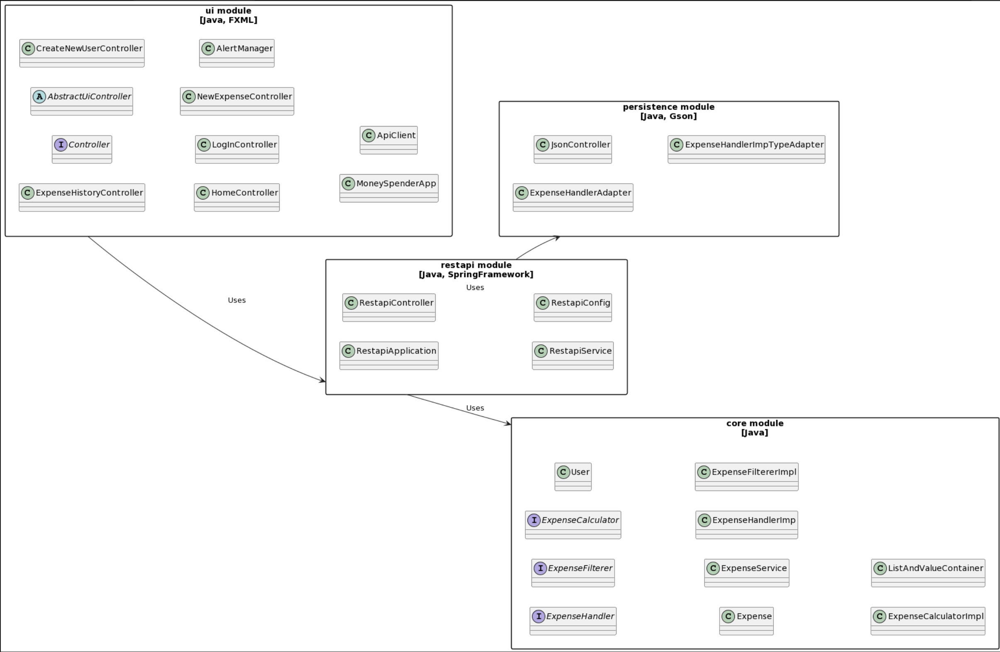

# Release 2

## Documentation for Release 2

- [Sprint Goals](#sprint-goals)
- [Tasks Completed](#tasks-completed)
- [Work Habits](#work-habits)
- [Scrum Process in Our Project](#scrum-process-in-our-project)
- [Architecture and Modularization](#architecture-and-modularization)
  - [Core](#core)
  - [UI](#ui)
  - [Server](#server)
- [Storage Medium](#storage-medium)
- [Testing](#testing)
- [For Next Time](#for-next-time)

## Sprint Goals

- Implement an expense overview feature.
- Create separate login and registration pages.

For detailed user stories related to this sprint, please refer to our [User Stories Documentation](user_stories).


## Tasks Completed

- Tests for all classes in the core module (L)
- Tests for all classes in the UI module (L)
- Tests for the JasonController class in the server module (M)
- Implementation of ExpenseHandler (M)
- Implementation of ExpenseService (M)
- Implementation of Jacoco (M)
- Implementation of Spotbugs (M)
- Implementation of Checkstyle (M)
- Expansion of the UI module to 5 user interfaces (L)
  - Log in page
  - Create a new user page
  - Home page
  - See history page
  - Create a new expense page
- Documentation (L)
  - Update the root-level README
  - Update the README in the core module
  - Update the README in the UI module
  - Update the README in the server module
- Diagrams (L)
- Set up Eclipse Che (M)
- Testing (L)
  - Testing the core module
  - Testing the UI module
  - Testing the server module

Estimated time: Small(S), medium(M), and Large(L)

## Work Habits

Based on the feedback received during Sprint 1, the team has designed a registration page for new users. We have retained one of our key work routines, which is to hold regular weekly meetings. In this sprint, we have largely transitioned to digital meetings since several members couldn't attend physically. The group has found digital meetings to be effective, particularly benefiting from screen sharing functionality. In the final week before submission, we have returned to physical meetings, and we intend to maintain this approach.

During the meetings, we have had "Daily Standup" where each group member shares updates on what they have worked on since the last meeting. One group member has taken the responsibility to document these updates in a meeting report. Furthermore, we have discussed future priorities and distributed upcoming tasks among us.

Given the group's diverse programming experience, we have actively utilized pair programming. This has been a valuable tool for sharing experiences and knowledge. Pair programming improves collaboration and ensures quality control. When working with this method, we indicate the participation of both parties in commit messages by using "Co-authored-by: @username" in the footer section.

To maintain clarity and structure in our project development, we use the issue board in Gitlab. Using labels like "open," "todo," "doing," and "closed," we can easily track the progress of each issue. When a group member takes on a task, they assign themselves to the relevant issue and move it to the "doing" column. This system provides the entire team with continuous visibility into who is working on what and ensures a balanced workload distribution.

### Development Procedure

1. **Create Issue**: If a task is vague, we clarify it by using checkboxes in the issue.

2. **Local Development**:
   - Create a local branch, named based on the issue, e.g., `15-write-test-to-user-in-core-module`.
   - Code, test, and commit according to [this guide](https://gist.github.com/qoomon/5dfcdf8eec66a051ecd85625518cfd13).

3. **Push and Merge Request (MR)**:
   - After successful testing, push the code.
   - Create an MR on GitLab linked to the original issue, explaining the changes and why they were made.

4. **Review**:
   - Another team member should approve the MR after reviewing the code.
   - After approval, the MR is merged into the `Sprint2` branch.

This ensures quality control, as all changes are reviewed by at least one team member.


### Workflow and Communication

- **Labeling**: We introduced an `ASAP` label for high-priority tasks. Other labels like `core`, `test`, and `database` help us systematically categorize tasks.

- **Task Descriptions**: Starting from Sprint 1, we've focused on clarity in task descriptions to ensure that everyone understands what needs to be done.

- **Git Procedures**:
  - Continued use of "conventional git message" for clarity.
  - Enhanced Merge Request (MR) discussions. The assigned person on the MR must review and comment before merging. We emphasize positive, explanatory feedback.
  - Improved MR titles for clarity.

- **Communication**:
  - Mainly through Slack, organized in specific channels for clarity.
  - GitLab is used for discussions related to code changes and MRs.


## Scrum Process in Our Project

We are dedicated to following Scrum as our preferred framework for project management. Below is an overview of how we have implemented Scrum principles in our work:

### Daily Standup Meetings

We conduct daily standup meetings to ensure that all team members are up to date and to identify any obstacles early.

### Sprint Review

After the completion of Sprint 1, we conducted a Sprint Review. In this session, we evaluated progress and discussed specific challenges, such as the absence of a registration page for new users and opportunities to view previous expenses.

### Sprint Retrospective

In our Sprint Retrospective, we reflected on our use of Git, identified areas for improvement, and discussed actions to enhance our workflow in upcoming sprints.

### Sprint Planning

During Sprint Planning, we identified user stories and created related issues that we believe will be critical to the project's success. In this session, we also introduced the "ASAP" label to prioritize tasks that require immediate attention.

## Architecture and Modularization

We have employed a multi-module architecture. We have done this to ensure a more robust and scalable solution. This architecture divides the app into three distinct modules: `core`, `server`, and `ui`, each with its own area of responsibility.

## Core

The Core module is the brain of the application. It contains all the central logic and fundamental classes. The Core module ensures that the application's functionality runs as expected, independent of the user interface or data storage.

### Core in Release 1

In Release 1, the idea was for a user to have a list of expenses (linked to an expense). This created a one-to-many relationship from a user to an expense, and each expense could only belong to one user. The idea behind this was to make it easy to set up a "Minimum Viable Product," and it would also simplify storage. This would also make it straightforward to implement a user interface where, in Release 1, we only had one view and the ability to add expenses to a user. However, this did not provide the capability to view the expenses added by the user, something we wished to implement in Release 2.

### Core in Release 2

In Release 2, we wanted the `User` class to solely represent a user and primarily have methods related to user representation. If the `User` class were to have a list of expenses, it would necessarily require methods for expense handling, which we wanted to avoid to adhere to the SOLID principle of "single responsibility."

Therefore, we created the [ExpenseHandler](../../money-spender/core/src/main/java/core/ExpenseHandler.java) class to act as the link between a user and their expenses. The relationship between `User` and `ExpenseHandler` is now one-to-one. The relationship between `ExpenseHandler` and `Expense` is now one-to-many, where an `ExpenseHandler` has a list of expenses. The `ExpenseHandler` is responsible for providing logic and implementation that would otherwise be in the `User` class. This includes methods for expense handling, such as adding and removing expenses and filtering already created expenses.

With this solution, we identified a potential encapsulation problem due to the tight coupling and dependency between `User` and `ExpenseHandler`. To allow a logged-in user to add expenses, one must have access to the user's `ExpenseHandler` through the user's `getExpenseHandler()` method. This provides direct access to a user's `ExpenseHandler`.

One possible solution would have been to return a new `ExpenseHandler` object with the same content. However, this would break the tight association the user has with their `ExpenseHandler`.

To address the identified challenges, we introduced the [ExpenseService](../../money-spender/core/src/main/java/core/ExpenseService.java) class. This class is designed to act as a bridge between the UI controllers and the `ExpenseHandler`.

By using `ExpenseService`, we ensure that the underlying `ExpenseHandler` associated with a user is not directly exposed. It delegates tasks directly to a user's specific `ExpenseHandler`. This ensures that the implementation and logic remain consistent and shielded, making it easier for the UI controllers to handle expenses. This is achieved, in part, through the offering of static methods, such as:

```java
addExpenseForUser(User user, Expense expense)
```

## UI

The `ui` module handles all aspects related to the user interface. This module includes controller classes that manage user interactions and FXML files that describe the interface's design.

## UI in Release 1

During Sprint 1, we introduced a basic user interface for interaction. This led to two primary challenges:

1. It was unclear how to create a new user.
2. The user couldn't visualize expenses as this feature was not implemented, even though it was planned for this sprint.

## UI in Release 2

In Release 2, we significantly improved the user interface to provide a more intuitive user experience. We introduced five new views: `LogIn`, `CreateNewUser`, `Home`, `ExpenseHistory`, and `NewExpense`, all implemented as FXML files. This gives the user a clear understanding of available functionality.

- `LogIn`: This is the first screen the user sees upon startup. Here, the user can log in or register a new account.
- `CreateNewUser`: This screen manages the registration of new users. After successful registration, the user is redirected to `Home`.
- `Home`: This is the user's main page, displaying the latest expenses and providing access to `ExpenseHistory` and `NewExpense`.
- `NewExpense`: Here, the user can add new expenses.
- `ExpenseHistory`: This screen offers advanced filtering options for previous expenses.

To further enhance the user experience, we have also implemented an `AlertManager` class. This class provides methods for displaying alerts to the user, either to confirm successful actions or to notify of errors. This decision was made after observing recurring methods in the controller classes, and by centralizing this functionality, we reduce redundant code and simplify maintenance.

## Server

This is our dedicated module for JSON storage. It serves as a bridge between `core` and the actual data stored on disk.

### Server in Release 1

In Release 1, we introduced `JsonController`, which used Google's GSON library to efficiently store and retrieve User objects in JSON format. The `JsonController` class utilizes some of GSON's methods, such as `fromJson()` and `toJson()`. Using these methods, the `JsonController` serializes and deserializes data to the selected file. We also used GSON's @Expose annotation to determine which fields in the objects should be included in serialization, resulting in the desired format during storage.

### Server in Release 2

In Release 2, we have retained the `server` module without any changes. Our three-layered architecture allows the `server` module to remain unaffected by changes in the `core` module. Therefore, there are no changes in the class except for code formatting. The formatting has been done to meet the standards set by the code quality tool `Checkstyle`. For more information about `Checkstyle`, refer to [readme.md](../../readme.md) under "Building with Maven."

In Release 2, we implemented tests for `JsonController` in the `JsonControllerTest` class. Each test method creates a `test.json` file and writes to it. After each test method, this file will be deleted. This is to ensure that each test method runs under the same conditions and avoids inconsistency.


## Modularization

By dividing the application into modules, we have achieved several objectives:

1. **Encapsulation**: Each module has its own `module-info` class. This class defines which other modules are required and which of its own packages are accessible to other modules, providing a high level of encapsulation.
2. **Clear MVC Separation**: With this modularization, we have successfully created a clear separation between the model, view, and controller, which are the core components of the MVC architecture.
3. **Flexibility**: Modules can be developed independently of each other, providing us with great flexibility in the development process.

Below is the diagram of the package structure:


For a more detailed overview, please refer to the [readme.md](../../money-spender/readme.md) file in the [money-spender](../../money-spender) directory.


## Storage Medium

In our project, starting from release 1, we opted for the document metaphor, which represents desktop storage. We made this choice to ensure the permanent storage of our application's data. Our goal was to store data in a dedicated file that could be accessed outside the application. This approach was preferred as our application is intended for long-term use to track user expenses, making the document metaphor the most natural choice.

To achieve this, we chose to store data in JSON files because of their simplicity and readability compared to text files. The file used for storing and retrieving data is located in a separate folder within the user's 'Home' directory on the PC.

We integrated and used the Gson library for this purpose. The Gson library excels in storing data in JSON format and rapidly constructing objects, making it a valuable asset for our application.

## Testing

### JaCoCo

We have adopted JaCoCo to generate reports on code test coverage. This helps us assess how well our code is covered by tests. You can find the reports in the `target/site/jacoco` directory within each module after building, or by running `mvn verify`.
For more information about JaCoCo, please refer to [readme.md](../../readme.md).

### Checkstyle

Checkstyle is implemented to ensure that our code adheres to a specific coding standard. This contributes to code readability and maintainability. The standard we use is `eclipse-java-google-style.xml`, which is included in the config folder. When running `mvn verify`, the code is checked against this standard, and any deviations are reported.
For more information about Checkstyle, please see [readme.md](../../readme.md).

### Spotbugs

We use SpotBugs to identify errors and weaknesses in the code. When we run `mvn verify`, SpotBugs scans the code for errors and warns us during the build process. This contributes to a more reliable and secure codebase. We have configured SpotBugs to use the `spotbugs-exclude.xml` file in the config folder, which instructs SpotBugs to ignore certain errors that we consider inconsequential.
For more information about Spotbugs, please consult [readme.md](../../readme.md).


## For Next Time

### Splitting of ExpenseHandler

In our upcoming iteration, our goal is to restructure the `ExpenseHandler`. We aim to have each class or component with a simple, clearly defined responsibility in line with the Single Responsibility Principle. This will result in a more modular and maintainable `core` module.

### Introduction of Interfaces

To support this modularization, we will introduce interfaces. This will provide several advantages:

1. **Flexibility**: By defining functionality through interfaces, we can easily swap out or change implementations without disrupting the rest of the system.
2. **Scalability**: New features or modules can be easily added by implementing the relevant interfaces, giving our app a scalable architecture.
3. **Testability**: With interfaces, we can easily mock dependencies in tests, ensuring that we can write robust and reliable tests for our logic.
4. **Clear Contracts**: Interfaces define clear contracts that implementing classes must adhere to, providing a clear understanding of what is expected from each component.

By combining the splitting of the `ExpenseHandler` with the introduction of interfaces, we aim for an architecture that is both robust and flexible, capable of growing and adapting to future needs without major restructuring.

### UI Testing and Data Storage

We want to change how UI tests store data. In Sprint 2, test users created by UI tests are stored in the main storage file. This is undesirable, and we plan to remove this in Release 3. We intend to either have a separate test file or to delete test users after the tests are executed. This is because we do not want unnecessary test users in the storage file.
