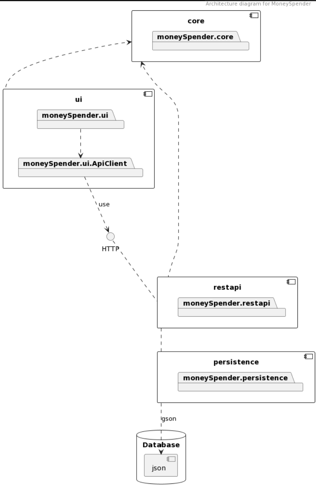

# Documentation Sprint3

## New features

For this release we have created a REST-API with Spring Boot and implemented the functionality to delete an expense and see total price of expenses. We have updated the user interface.

## Contents

- [Sprint Goal](#sprint-goal)
- [User Stories](#user-stories)
- [Issues solved](#issues-solved)
- [Development Procedure](#development-procedure)
- [Working Flow with Scrum](#working-flow-with-scrum)
  - [Scrum in our project](#scrum-in-our-project)
  - [Sprint review](#sprint-review)
  - [Sprint retrospective](#sprint-retrospective)
  - [Sprint Planning](#sprint-planning)
  - [Structure](#structure)
  - [Meetings](#meetings)
- [Code quality](#code-quality)
- [Testing](#testing)
- [Spotbugs](#spotbugs)
- [Pipeline](#pipeline)
- [Architecture](#architecture)
  - [Rest api](#rest-api)
  - [Core](#core)
    - [New class](#new-class)
    - [Interfaces](#interfaces)
  - [Ui](#ui)
  - [Persistence](#persistence)
- [Challenges in Sprint 3](#challenges-in-sprint-3)
  - [Distribution of work](#distribution-of-work)
  - [Dependencies in tasks](#dependencies-in-tasks)
  - [Spring boot](#spring-boot)
- [In future sprints](#in-future-sprints)

## Sprint Goal

Rest api, improve the user interface, and possibility to delete an expense

## User stories

(Add user stories here)

## Issues solved

- Implement Rest Api (L)
- Update the user interface in the application (M)
- Refactor core (modularity) (M)
- Implement delete expense in ui (M)
- Documentation (L)
  - Update readme in all modules
  - Update package diagram
  - Make architecture diagram
  - Update class diagram
- Shippable product (S)
- Bugs from Spotbugs related to Sprint 2 (M)
- Ui test writes to own file (M)

**Estimated time:** Small (S) medium (M) Large (L)

## Development Procedure

Maintaining the structure from Sprint 2, our workflow's clarity is fortified through diligent utilization of GitLab's issue board, encompassing labels, milestones, and boards. This sprint introduced the "MR-review" board. Issues ready for merging are shifted to this board, where they await a reviewer's approval before the final merge, offering a transparent view of various issues' statuses. Additionally, we incorporated GitLab's Pipeline this sprint, ensuring core and server tests mitigate possible setbacks in the Sprint branch.

Mirroring the consistency sought in Sprint 2, our objective was a robust and uniform workflow with GitLab. For a detailed insight into our GitLab usage, refer [workflow](/docs/workflow/workflow.md). In certain instances, we employed dev-branches. The primary intent behind the Dev-branch is to prevent any merges into the Sprint3-branch that could result in test or behavior failures. For instance, we established a 'Dev-expense-removing-and-Testing' branch, enabling us to address various issues tied to the new functionality and testing, without triggering any "build failure" in the Sprint3 branch.

## Working Flow with Scrum

After Sprint 2, we conducted a sprint review and retrospective with one reference person. Post-review, we discerned that our application had evolved into a more intricate system with augmented functionality. Additionally, the user stories received approval. While our Git structure excelled, we resolved to include the location of changes in our commit messages. It's also been emphasized that prior to making a Merge Request, at least the tests relevant to modified files should be executed. Only two team members were adept at formatting to avert Checkstyle warnings. This introduced extra workload as these two members had to format branches pre-merge.

### Scrum in our project

We are trying to follow as many concepts from the Scrum framework as possible. Because we don't have the resources to be a 100% Scrum team we have made some modifications. Under is how to used Scrum in Sprint 3.

#### Sprint review

The first meeting after the delivery of assignment 2 conducted we a review of the current product. In this part located we some areas for improvements as the ability to delete an expense, and a better view of expenses was some of the things we discovered.

#### Sprint retrospective

In the sprint retrospective reflected we the working flow with Gitlab and discussed measures to improve the working flow in Sprint 3. One thing we discussed is to improve the header in commit message, we want to make it easier to understand which file the commit is related to. In Gitlab we found the difficult to always spot bugs related to the MR. Therefor we all agreed that we need to have better communicate if some changes in the MR is unclear. We also discussed if we should implement pipelines in Gitlab.

#### Sprint Planning

After concluding our sprint retrospective, we initiated the sprint planning. During this phase, we formulated new user stories to enhance the application's capabilities. While typically the responsibility of the product owner, our retrospective served as a platform for brainstorming and identifying key functionalities. We also established issues related to these user stories and criteria specific to Assignment 3. To ensure streamlined oversight of Merge Requests (MR), we decided to implement pipelines. Additionally, we allocated broader work domains among the team members.

### Structure

Our workflow clarity is achieved through the meticulous use of GitLab's issue board. Retaining the structure from Sprint 2, we utilize labels, milestones, and boards. This sprint saw the introduction of a new board titled "MR-review." When an issue is primed for merging, it's transitioned to this board, awaiting approval from a reviewer before the final merge. This board lucidly depicts the state of various issues. Another enhancement this sprint was the integration of GitLab's Pipeline, ensuring that core and server tests prevent potential failures in the Sprint branch.

### Meetings

Communication, a pivotal aspect of teamwork, is facilitated chiefly through our regular meetings. Despite not conducting daily stand-ups, we actively engage on Slack daily. This sprint saw us convening twice a week, with an additional meeting when deemed necessary. Meetings alternated between digital and physical mediums, maintaining a 50/50 ratio. From our positive experience with digital meets during the last sprint, we've resolved to favor digital platforms if any member faces challenges attending in person. Our sessions invariably commence with a daily standup, spanning approximately 30 minutes, followed by a dedicated 1.5-hour work period, which often involves collaborative problem solving and pair programming.

## Code quality

For this release we wanted to improve the code quality specially in the modules existing from Sprint 2. This included in several new interfaces and abstract classes in both ui and core module. As a result of this we added a new class `ExpenseHandlerAdapter` to serialized and deserializing of expense. However this class is not used because we run into some trouble with with serializing the interface when using Sprint Boot. This class will not be used in this sprint, but in future sprints we want to use `ExpenseHandlerAdapter`, reade more about this [here](#in-future-sprints). Therefor we needed to implement a specific type adapter `ExpenseHandlerImplTypeAdapter`, more information about the class [here](#persistence)

## Testing

We are testing every module in the projects, where we have used JaCoCo to check the test coverage. We want to achieve at least 80% test coverage from JaCoCo in every module. The core and persistence modules are tested separately. We did not see any point of just testing FXML-component, therefore we implemented integrated ui tests. The ui tests are testing the whole architecture together. In some ui-test-classes we use jsonController to setup the test environment with ready-made conditions for immediate testing, like direct user login without manual user creation. The tests in ui now writes to a own test-file which is deleted after the test is executed.

We have one test class to every ui controller class, testing the behavior related to that controller. We also have a user stories test class which test the behavior of this user stories:

- Try login without any user, then try creating a new user with parameters that should lead to success.
- Then testing login with the new user created and create an new expense with "not-existing-category".
- Test log in with the created user and create an expense with "existing-category".
- Test log in with the created user, and apply different filters in the seeHistory page.
- Test deleting of existing expense.
- Test the total price is correct and updated when adding and deleting new expenses or filtering.

### Spotbugs

We have spotbugs running in every module in the project. We use spotbugs to locate different weakness in the code. From Sprint 2 Spotbugs located some issues we have fixed in this sprint. For example located Spotbugs "Format string should use %n rather than \n", in this way could we improve our code quality.

### Pipeline

For this release we implemented the GitLab CI/CD pipeline. The pipeline is running the script; "cd money-spender; mvn clean test -DskipUiTests". We have not included the ui-tests because this would require additional configurations or tools, such as setting up headless browsers or using specific runners. We found the pipeline very important in our projects, and we see the straightness of writing tests to the projects. In this way no MR will be approved and merged without passing the pipline. This is one of the first thing the reviewer of the MR will check before moving forward with the MR.

## Architecture

The recent assignment led to considerable expansion, not just visually, but also at the code base level. Assignment 3 necessitated the incorporation of a REST API, the introduction of new functionalities, and the exploration of novel technologies. We elected to extend our application via new user stories, continuing our reliance on JavaFX.

Our project is built adhering to modularization principles, encompassing modules such as core, ui, restapi, and persistence. Each module's distinct role ensures clarity regarding its function.

### Rest api

Our REST API is developed using Spring Boot, enabling platform-independent communication between clients and servers, primarily through HTTP. This stateless interface guarantees that each request contains all the necessary information, enhancing security and efficiency. By standardizing communications, it facilitates the seamless execution of CRUD operations. Thanks to its data reuse and caching capabilities, systems can scale effortlessly while consistently meeting user demands. The efficiency and versatility of REST APIs make them an invaluable tool for a wide array of modern applications.

We've designed an `ApiClient` that primarily interpreter requests from the user interface. The `RestapiController` class is invoked from the UI and receives CRUD requests. The `RestapiService` turn requests from the `RestapiController` and delegates further to the `JsonController` that execute action on the storage data. For instance, if the UI sends a request to view all expenses, the `JsonController` retrieves the correct user information, and then the `ExpenseService` handles the logic to gather all the parameters related to the expenses. Once the response is returned from the server-side application, and if the request has been successfully processed, the data is then returned to the UI to be displayed to the user.

See class diagram of restapi [here](../diagrams/ClassDiagramRestapi.png)

### Core

#### New class

We have introduced a new class, `ListAndValueContainer`, which encapsulates a list with expenses and a numeric double-value. This enhancement is strategically designed to streamline API interactions, enabling a single request to retrieve both user expenses and the total price values of expenses. This consolidated approach significantly reduces the need for multiple API calls, thus optimizing our data retrieval process.

See class diagram of core [here](../diagrams/ClassDiagramCore.png)

#### Interfaces

Interfaces play a pivotal role in the development of robust and flexible systems. By defining system functionality through interfaces, we achieve a high degree of flexibility, as implementations can be easily swapped or updated without affecting other parts of the program. This supports extensibility, as new features can be introduced by implementing existing interfaces, providing a scalable and expandable architecture. Additionally, interfaces are invaluable for testability because they allow easy creation of mock objects for dependencies during testing, ensuring that we can build solid and reliable test coverage for our core functionality. Finally, by establishing clear contracts, interfaces ensure that all classes that implement them offer a clear understanding of expected operations, creating a clean and organized design. With these principles in mind, we have taken strategic steps to enhance the ExpenseHandler by introducing interfaces, preparing our system for future growth and changes with minimal need for restructuring. In the core module we have the following interfaces:

- `ExpenseCalculator`
- `ExpenseFilterer`
- `ExpenseHandler`

### Ui

Compared to Assignment 2, though our views remain largely unchanged, the home-view now showcases the ten priciest expenses along with their cumulative cost. The seeHistory-view has been enhanced with a delete function, transitioning from a text-area to a table-view. This table-view, we believe, offers clarity, aligning well with design principles. Expenses can be deleted by activating a red button; an alert ensures users don't unintentionally delete entries. We have because of the restapi also added one new class which is the connection to the restapi. The class `ApiClient` serves as a interpreter for the user interface, and request actions like create a new user, create a new expense, see history of expenses, ect. from the rest api.

We have added an interface and abstract class in the ui module. The `Controller` interface in ui module is smart because it establishes a clean separation of concerns by abstracting stage management, fostering flexible, testable, and maintainable UI code. The `AbstractUiController` provides a standardized method for managing the primary stage across various UI controllers, ensuring consistency and reducing code duplication in JavaFX applications.

See class diagram of ui [here](../diagrams/ClassDiagramUi.png)

### Persistence

We renamed the "server" module to "persistence" to better reflect its primary role in the application. This change was motivated by the recognition that the original name did not accurately convey the module's functionality. "Server" suggested an emphasis on serving content over a network or handling client-server interactions, which could be misleading since the module's responsibilities are centered around data serialization with Gson and managing file storage operations.

The new name, "persistence," instantly communicates the module's purpose: ensuring the durability and access of data across different sessions of application use. It aligns with industry conventions where "persistence" typically describes mechanisms for storing and retrieving data to and from a persistent storage medium like a file system or database.

By choosing "persistence," we also achieve a more cohesive and intuitive naming structure alongside the other modules — "core," "ui," and "restapi" — which respectively handle the application's fundamental logic, user interface, and web API interactions. This clarity in naming assists both new and existing developers in quickly grasping the design and architecture of our application, leading to more efficient development and collaboration processes. It is a strategic step toward making our application's architecture self-explanatory and our codebase more navigable.

The `ExpenseHandlerImplTypeAdapter` class is a crucial component for applications that manage user data. It is a typeAdapter which is used with the GSON library, and is suited for the ExpenseHandlerImpl class. It serves as a bridge between the ExpenseHandler objects in the application and their JSON representation. This class is important because it ensures that ExpenseHandler objects can be serialized and deserialized properly, allowing for a consistent and reliable conversion to and from JSON, which is a common format for data interchange. It handles the intricacies of mapping complex Java objects to a universally readable JSON format, which is essential for data persistence, communication between services, or API responses.

The `JsonController` class providing a high-level interface for managing JSON data related to User objects. It encapsulates the functionality for creating, reading, updating, and checking user information stored in JSON files. This class is important because it abstracts the file handling and JSON parsing logic, making it easier to perform operations on user data. It ensures that user data is stored and retrieved in a structured and secure manner, which is vital for maintaining the integrity and privacy of user information in financial applications. The use of the Gson library with custom adapters and exclusion strategies further enhances the flexibility and security of the data handling process.

See class diagram of persistence [here](../diagrams/ClassDiagramPersistence.png)

## Challenges in Sprint 3

### Distribution of work

Our goal is to evenly distribute the workload among team members, but during this sprint, we encountered challenges with an uneven distribution of work. The sprint was demanding, particularly regarding the implementation and restructuring of the REST API. We have reflected on the reasons for this imbalance and regard it as a valuable learning experience for future group projects. From the outset, the varying Java programming skills among group members were apparent. We have tried to level these differences by introducing practices such as pair programming and by working collaboratively post-meetings. At the start of Sprint 3, we assigned tasks and defined focus areas with a dedicated sparring partner for each area. Those tasked with implementing the REST API ended up with a heavier coding load due to their deeper understanding of the system. Time constraints and challenges in coordinating meetings also contributed to difficulties in leveling knowledge gaps. Ideally, we would have held a workshop to teach the entire group about REST API implementation. As a measure, we conducted a demonstration to explain how REST APIs work and the necessary changes for integration into the application.

### Dependencies in tasks

An additional challenge has been the dependencies between tasks. This has meant that certain tasks could not be started until others were completed, affecting workflow and delaying project progress.

### Spring boot

We faced challenges with Spring Boot's automatic configuration of self made templates. Our aim was to use a separate configuration file to simplify and clarify our code by separating out the template logic from the API client. Unfortunately, this proved to be incompatible with Spring Boot's configuration handling. After consulting with our technical teaching assistant, we agreed that while having a separate configuration file was not critical to the project's success, it was a desired step to improve the project's structure. We recognize that this would have been beneficial for the clarity and maintainability of the code, but we proceeded without this functionality following advice from the assistant.

## In future sprints

**Data Visualization and saving target integration:**
To enhance user experience and provide greater insight into financial behavior, we can introduce advanced data visualization techniques in the application. This would involve developing a set of interactive charts and graphs that display user expenses and savings over time. By utilizing color-coded graphs, we can illustrate various expense categories and saving goals, providing users with an immediate understanding of their financial status and progress. The visualization will also include trend lines and possibly predictive analytics to help users understand how their current spending patterns may affect future financial goals. This will be a powerful tool to promote financial responsibility and planning.

**User Profile Customization:**
To offer a more personalized and relevant user experience, we can implement user profile customization features. This will allow users to set up and modify their preferred currency and language, which is particularly useful for frequent travelers or those living in multilingual regions. Additionally, we can provide customized notification settings, enabling users to choose how and when they receive alerts about their finances – such as weekly summaries, alerts for significant expenses, or reminders to log expenses. These customization options will not only improve usability but also enhance user engagement and interaction with the application.

**Mobile Application:**
Considering that many users are often on the move and may find it inconvenient to log expenses on a PC, developing a mobile version of the application could be beneficial. A mobile application would offer greater accessibility and convenience, allowing users to record expenses in real-time, such as while shopping or immediately after a purchase. This would reduce delays and potential forgotten expenses, leading to more accurate financial tracking. The mobile application could also leverage smartphone features, like the camera to take pictures of receipts, and location services to automatically categorize expenses based on the purchase location. By offering a mobile application, we can also integrate push notifications to remind users to update their expenses or inform them when they are approaching budget limits, further improving financial management.

**ExpenseHandlerAdapter:**
We want to use the `ExpenseHandlerAdapter` because we prefer to use the `ExpenseHandler` interface, rather than the `ExpenseHandlerImpl` and `ExpenseHandlerImplTypeAdapter`. By using an interface, one can decouple the code from a specific implementation. This means that one can change the underlying implementation of ExpenseHandler without having to change the code that uses the interface. This makes the system more flexible and easier to maintain. In this sprint, we encountered issues where Spring Boot did not know how to serialize the `ExpenseHandler`. This is a challenge we have not yet resolved with the Spring Boot and `ExpenseHandlerAdapter`, but it is something we aim to focus on in future sprints. We plan to investigate this issue further and implement a solution that clearly defines which `ExpenseHandler` implementation Spring Boot should use, ensuring a more robust application configuration.
