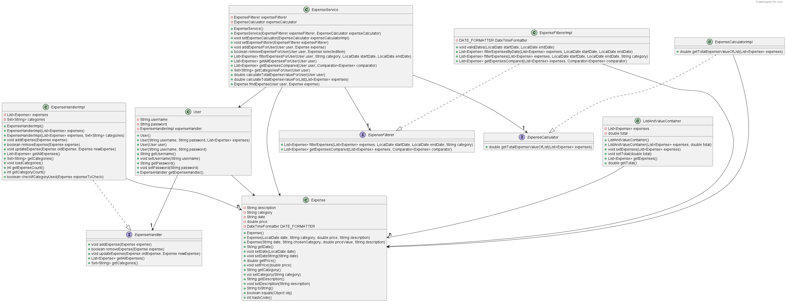

# Core Module

## Description

The core module in Moneyspender contains classes for managing user objects and expenses. Users can log in using their usernames and passwords, and the `User` class encapsulates user data, including usernames, passwords, and a list of associated expenses. Expenses are represented by the `Expense` class, which stores details such as date, price, category, and description. Additionally it offers features such as expense filtering, sorting, and total value calculation.

## Core Module Classes

In the core module of Moneyspender, we have seven classes and three interfaces:

- **User**: The `User` class represents a user of the application, handling user data and authentication.

- **Expense**: The `Expense` class represents an individual expense item, encapsulating details like date, price, category, and description.

- **ExpenseService**: The `ExpenseService` class in the core module serves as a utility for managing expenses of a User, offering functionality to add, remove, filter, retrieve, and calculate expenses, while encapsulating interaction with the User's `ExpenseHandler`.

- **ListAndValueContainer**: The `ListAndValueContainer` class serves as a container for a list of Expense objects and their total value. It's primarily used for sending this data in HTTP responses.

- **ExpenseHandler & ExpenseHandlerImpl**: The `ExpenseHandler` interface defines methods for managing expenses, adding, removing, updating, and retrieving expenses, as well as obtaining unique expense categories. The `ExpenseHandlerImpl` class implements these methods.

- **ExpenseCalculator & ExpenseCalculatorImpl**: The `ExpenseCalculator` interface outlines a method for computing and returning the total value of a list of expenses. The `ExpenseCalculatorImpl` implements this interface.

- **ExpenseFilter & ExpenseFilterImpl**: The `ExpenseFilter` interface sets out methods for filtering and sorting expenses. The `ExpenseFilterImpl` implements this interface, offering filtering and based on date ranges and categories, as well as sorting expenses.

## Classdiagram

Below you can see the classdiagram for the core module.



## Testing of core

You can access the tests for core in `money-spender/core/src/test/java/core`.
You can run the tests with this command:

```shell
mvn test
```

## Testing Code Quality

To ensure high code quality standards in our core module, we employ a set of code analysis and quality assurance tools. These include:

- **JaCoCo**: We use JaCoCo to measure test coverage. When you run `mvn test`, JaCoCo generates code coverage data. To access the JaCoCo report, follow these steps:

    1. Navigate to the `target` folder in ui
    2. Within the target directory, find the `site` folder and enter it.
    3. You will find the `jacoco` folder. Open it.
    4. Among the files inside the jacoco folder, you'll see `index.html`. Right-click on this file and select 'Open' in your web browser to access the JaCoCo report.

- **Spotbugs**: Spotbugs helps us identify potential bugs and issues in the codebase.

- **Checkstyle**: We employ Checkstyle to enforce coding style and standards. Checkstyle uses `config/checkstyle/eclipse-java-google-style.xml` as its reference for code checking.

## Building with Maven

### Dependencies

The Core module relies on the following dependencies:

- **gson**: Library for converting Java objects to JSON and vice versa.
- **junit-jupiter-api**: Implements the JUnit API.
- **junit-jupiter-engine**: Executes JUnit tests.
- **junit-jupiter-params:** Supports parameterized tests in JUnit.

### Additional Plugins

The Core module utilizes additional Maven plugins for various purposes:

- **maven-compiler-plugin**: Compiles source files in the project.
- **maven-surefire-plugin**: Executes unit tests.
- **maven-checkstyle-plugin**: Enforces code quality checks using Checkstyle.
- **spotbugs-maven-plugin**: Detects bugs in the code using Spotbugs.
- **jacoco-maven-plugin**: Measures test coverage using Jacoco.
  