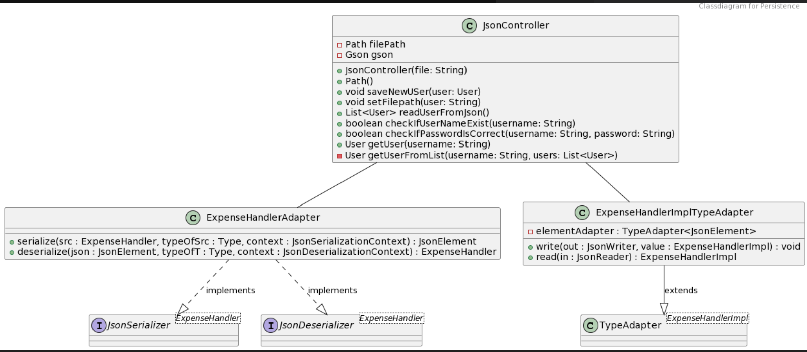

# Persistence Module

The `Persistence` module plays a role in managing data for the Moneyspender application. It includes three classes: `JsonController`, `ExpenseHandlerImplTypeAdapter` and `ExpenseHandlerAdapter`. These classes work together to ensure efficient data handling and support essential functionalities within the application.

## Persistence Module Classes

In the persistence module of Moneyspender, we have three essential classes:

- **JsonController**: The `JsonController` class handles JSON data related to User objects, offering methods to save, read, and manage user data. It initializes with a specified file name, creating the necessary file and folder structure if needed. It enables saving new users, reading user data, checking username existence, validating username-password combinations, and retrieving users by their usernames, streamlining user data management in JSON format.

- **ExpenseHandlerImplTypeAdapter**: The `ExpenseHandlerImplTypeAdapter` class handles the serialization of ExpenseHandlerImpl instances to JSON for data storage and transfer, and conversely, the deserialization of JSON back into ExpenseHandlerImpl instances.

- **ExpenseHandlerAdapter**: The `ExpenseHandlerAdapter` class serves as a guide for the Gson library. It Specifies which implementations of the ExpenseHandler interface to be used during serialization and deserialization of ExpenseHandler objects.

## Classdiagram

Below you can see the classdiagram for the persistence module.



## Testing of Persistence

You can access the test for JsonController in `money-spender/persistence/src/test/java/persistence`.
You can run the test with this command:

```shell
mvn test
```

## Building with Maven

### Dependencies

The **Persistence** module relies on the following `dependencies`:

- **Core**: The Persistence module relies on the Core module to access the 'User' class, which is essential for managing user data.
- **Google Gson**: The Gson library is used for the serialization and deserialization of JSON data.
- **junit-jupiter-api**: Implements the JUnit API.
- **junit-jupiter-engine**: Executes JUnit tests.
- **junit-jupiter-params:** Supports parameterized tests in JUnit.

### Additional Plugins

The **Persistence** module utilizes additional maven `plugins` for various purposes:

- **maven-compiler-plugin**: Compiles source files in the project.
- **maven-surefire-plugin**: Executes unit tests.
- **maven-checkstyle-plugin**: Enforces code quality checks using Checkstyle.
- **spotbugs-maven-plugin**: Detects bugs in the code using Spotbugs.
- **jacoco-maven-plugin**: Measures test coverage using Jacoco.
