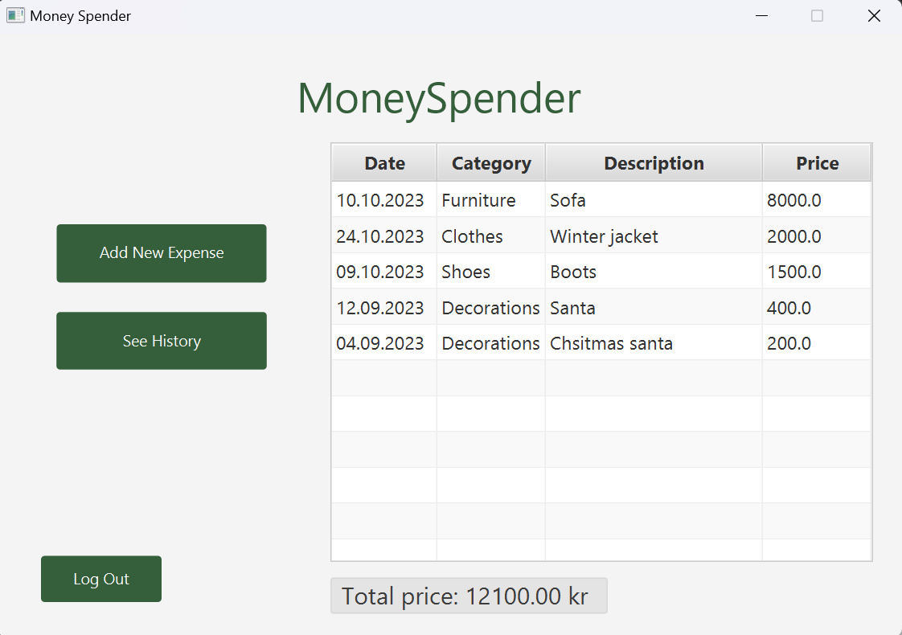

# Money Spender

## Money Spender - Expense Tracker

This app, Moneyspender, is a comprehensive expense tracking and financial management tool developed as part of the 'Informatikk Prosjektarbeid (IT1901)' course. Designed for students and anyone looking to take control of their finances, Moneyspender offers a user-friendly platform to log expenses and gain valuable insights into spending habits.

### Key features

- Effortless Expense Tracking: Easily record and categorize your expenses, whether it's for groceries, entertainment, or bills.

- Smart Filtering: Moneyspender allows you to filter and view expenses based on date and category, making it easy to analyze your spending patterns.

- Expenses are stored, which make it easy to access in the future.

### User interface

The MoneySpender interface maintains a simple and effective design. It offers a user-friendly home screen for adding expenses and an alternative view for reviewing your expense history. Users can filter expenses based on time periods and categories within the expense history view. The interface's clear headings, input prompts, and structured layout ensure enhanced usability and readability. Below, you'll find the MoneySpender home view.

### User stories

Our development process is rooted in user stories. Every feature we create is a direct response to these stories. Here are our user stories and the sprint to which each user story is related:

1 As a user of Moneyspender, I want to access the application by providing my unique username and password so that I can log in. (Sprint1)

2 As a user of Moneyspender, I want to record my expenses by providing a date along with the expense details so that I can keep track of when each expense occurred. (Sprint1)

3 As a user of MoneySpender, I want the ability to access and review my financial history within the app. (Sprint2)

4 As a user of MoneySpender, I want to see my spending in a specific time period. (Sprint2)

5 As a new user of MoneySpender, I want to create a personal user account. (Sprint2)

6 As a user of MoneySpender, I want the ability to sort my expenses by specific categories. (Sprint2)

7 As a user of MoneySpender, when I create a new expense, I want to choose from different categories.(Sprint2)

8 As a user of MoneySpender,  I want to see my most recent recorded expense when I log in. (Sprint2)

9 As a user I want the ability to remove expenses. (Sprint3)

10 As a user I want a view of my 10 most expensive expenses and see the total amount of money spent in the home view. (Sprint3)

11 As a user I want to see filter by date and see how much money I have spent. (Sprint3)

## Architecture

Money Spender follows a robust three-tier architecture. The [Core](../money-spender/core/readme.md) module forms the application's foundation, housing critical logic and data structures. [Restapi](../money-spender/restapi/readme.md) and [Persistence](../money-spender/persistence/readme.md) modules handle secure data storage and user authentication, serving as backend pillars. Lastly, the User Interface ([ui](../money-spender/ui/readme.md)) module ensures an intuitive user experience with user-facing components and interactions. Together, these modules create a secure, functional, and user-friendly expense tracking application.

