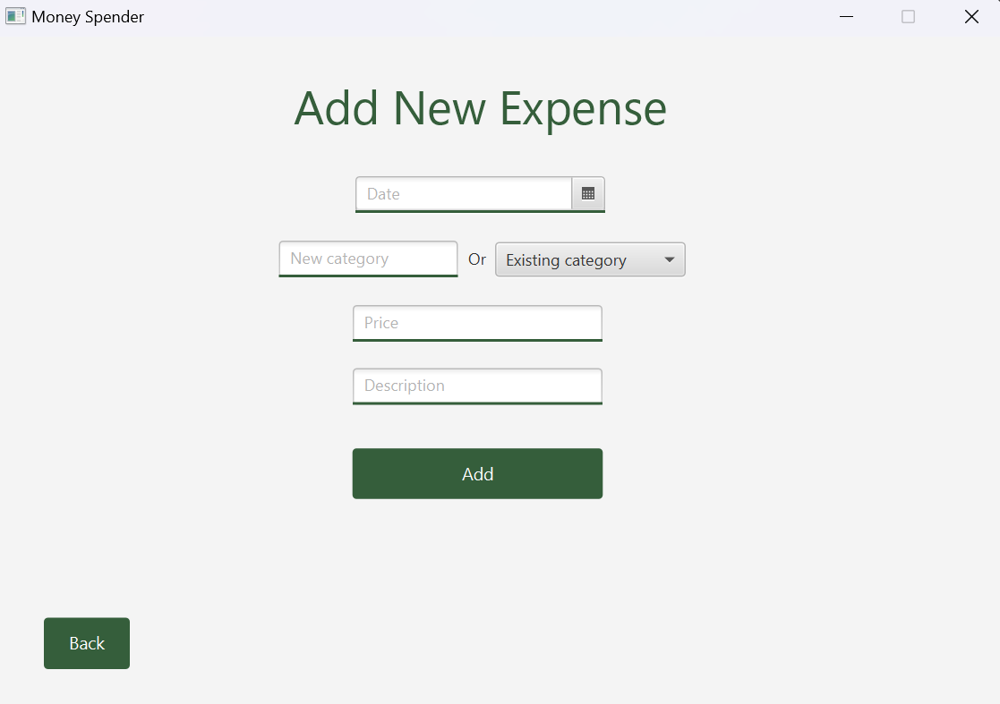
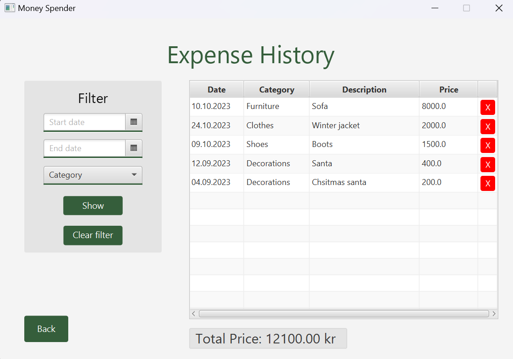
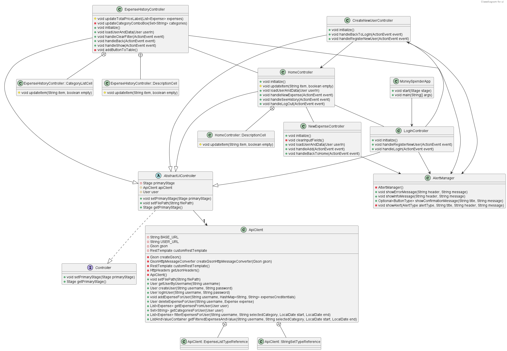

# UI - JavaFX-GUI

Presented below is a preview of some of the key views in the Moneyspender user interface:

## Home View


## New Expense View



## Expense History View



## Description

Moneyspender UI is developed using `JavaFX-GUI` as the framework and `FXML` as the markup language. JavaFX-GUI provides structure and functionality, while FXML is used to define and organize the visual elements of the interface.  

 Users begin by logging in with their username and password, gaining access to the home screen, which displays the biggest expenses. Alternatively, new users can register by clicking "Register New User" on the login screen. On the home screen, users can log out, add new expenses, or view their expense history. When adding a new expense, they enter details like date, category, description, and price, receiving a success message upon completion. Expense history allows users to filter and view expenses by category and date, with options to clear filters. The expense history view also allows the users to remove an expense. Finally, logging out returns users to the login screen.

### ApiClient

The `ApiClient` is serving as the bridge between the JavaFX-GUI frontend and the backend services powered by java.net package. This class is responsible for making HTTP requests to a RESTful API, handling tasks such as user authentication, registration, and expense management.

For detailed information regarding the restApi, please refer to the restApi readme [here](../restapi/readme.md).

## Classdiagram

Below you will find the classdiagram that provides a vizual representation of the classes and their relationships within the module.



## Running the Application

To launch the application, please visit the root-level readme [here](../../readme.md#running-the-project-with-eclipse-che).

## Testing of Ui

 For UI testing, we have dedicated tests for each class and an additional test for user stories. This approach ensures that the controllers function as expected and secures a positive user experience aligned with our initial user story objectives.

 To access the UI tests make sure that the server is running. If the server have not been started, follow the instruction [here](../../readme.md#running-the-project-with-eclipse-che). Start by navigating to the `money-spender` directory. To run the tests, use the following commands:

```shell
cd ui
```

```shell
mvn test
```

## How to Run Ui

For executing the user interface make sure that the server is running. If the server have not been started, follow the instruction [here](../../readme.md#running-the-project-with-eclipse-che). Start by avigating to the `money-spender` directory, and use the following commands:

```shell
cd ui
```

```shell
mvn javafx:run
```

## Testing Code Quality

To ensure high code quality standards in our core module, we employ a set of code analysis and quality assurance tools. These include:

- **JaCoCo**: We rely on JaCoCo to assess test coverage. When you run `mvn test`, JaCoCo generates code coverage data. To access the JaCoCo report, follow these steps:

    1. Navigate to the `target` folder in ui
    2. Within the target directory, find the `site` folder and enter it.
    3. You will find the `jacoco` folder. Open it.
    4. Among the files inside the jacoco folder, you'll see `index.html`. Right-click on this file and select 'Open' in your web browser to access the JaCoCo report.

- **Spotbugs**: Spotbugs helps us identify potential bugs and issues in the codebase.

- **Checkstyle**: We employ Checkstyle to enforce coding style and standards. Checkstyle uses `config/checkstyle/eclipse-java-google-style.xml` as its reference for code checking.

## Building with Maven

### Dependencies

The Ui module relies on the following `dependencies`:

- **core:** Used for representing Item objects.
- **persistence:** Utilized for serializing and deserializing.
- **javafx-controls:** JavaFX library for UI controls.
- **javafx-fxml:** Used for working with FXML files in JavaFX.
- **junit-jupiter-api**: Implements the JUnit API.
- **junit-jupiter-engine**: Executes JUnit tests.
- **junit-jupiter-params:** Supports parameterized tests in JUnit.
- **testfx-core:** Core for testing JavaFX applications.
- **testfx-junit5:** Integrates TestFX with JUnit 5 for UI testing.
- **hamcrest:** Provides matchers for testing in Java.
- **mockito**: Creating and managing mock objects in Java unit tests.

### Additional Plugins

The Ui module utilizes additional Maven `plugins` for various purposes:

- **maven-compiler-plugin**: Compiles source files in the project.
- **maven-surefire-plugin**: Executes unit tests.
- **maven-checkstyle-plugin**: Enforces code quality checks using Checkstyle.
- **spotbugs-maven-plugin**: Detects bugs in the code using Spotbugs.
- **jacoco-maven-plugin**: Measures test coverage using Jacoco.
- **javafx-maven-plugin**: Building JavaFX applications and configuring custom Java runtimes
- **jpackage-maven-plugin**: Simplifies the process of creating platform-specific installers and packages for Java applications.
